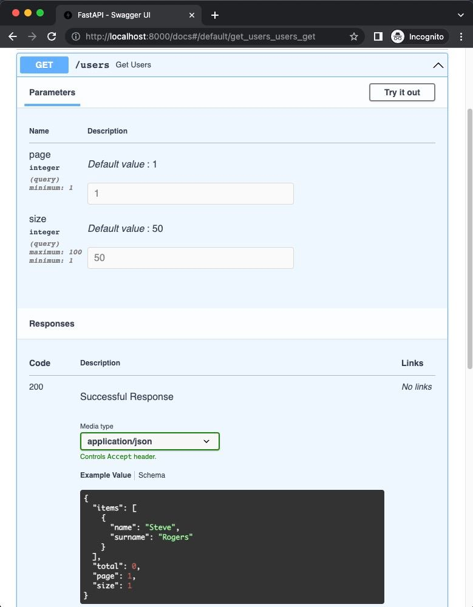

<h1 align="center">FastAPI Pagination</h1>

<div align="center">


<a href="https://pepy.tech/project/fastapi-pagination"></a>
<a href="https://pypi.org/project/fastapi-pagination"></a>

</div>

## Introduction

`fastapi-pagination` is a library that provides pagination feature for [FastAPI](https://fastapi.tiangolo.com/) applications.

----

For more information about library please see [documentation](https://uriyyo-fastapi-pagination.netlify.app/).

---

## Installation

```bash
pip install fastapi-pagination
```

## Quickstart

All you need to do is to use `Page` class as a return type for your endpoint and call `paginate` function
on data you want to paginate.

```py
from fastapi import FastAPI
from pydantic import BaseModel, Field

from fastapi_pagination import Page, add_pagination, paginate  # import all you need from fastapi-pagination

app = FastAPI()  # create FastAPI app


class UserOut(BaseModel):  # define your model
    name: str = Field(..., example="Steve")
    surname: str = Field(..., example="Rogers")


users = [  # create some data
    # ...
]


@app.get('/users', response_model=Page[UserOut])  # use Page[UserOut] as response model
async def get_users():
    return paginate(users)  # use paginate function to paginate your data


add_pagination(app)  # important! add pagination to your app
```

Please, be careful when you work with databases, because default `paginate` will require to load all data in memory.

For instance, if you use `SQLAlchemy` you can use `paginate` from `fastapi_pagination.ext.sqlalchemy` module.

```py
from fastapi_pagination.ext.sqlalchemy import paginate


@app.get('/users', response_model=Page[UserOut])
def get_users(db: Session = Depends(get_db)):
    return paginate(db.query(User).order_by(User.created_at))
```

For `SQLAlchemy 2.0 style` you can use `paginate` from `fastapi_pagination.ext.sqlalchemy_future` module.

```py
from sqlalchemy import select
from fastapi_pagination.ext.sqlalchemy_future import paginate


@app.get('/users', response_model=Page[UserOut])
def get_users(db: Session = Depends(get_db)):
    return paginate(db, select(User).order_by(User.created_at))
```

Currently, `fastapi-pagination` supports:
* `SQLAlchemy`
* `SQLAlchemy 2.0 style`
* `SQLModel`
* `Django ORM`
* `GINO`
* `ORM`
* `Ormar`
* `Asyncpg`
* `Piccolo`
* `Databases` 
* `Tortoise ORM`
* `MongoEngine`
* `Motor`
* `PyMongo`

## Example

Code from `Quickstart` will generate OpenAPI schema as bellow:

<div align="center">

</div>
