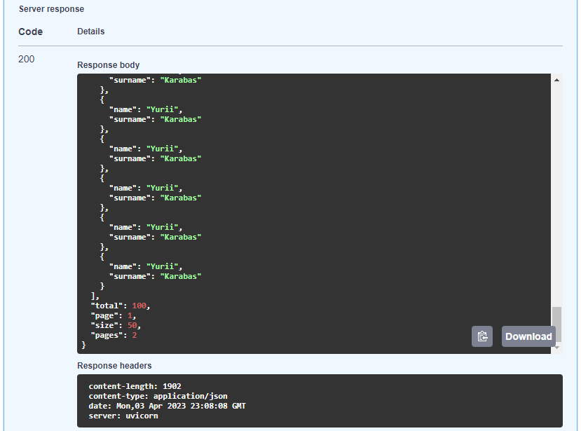

# FastAPI Pagination

FastAPI Pagination is an easy to use pagination addon for FastAPI.

## Features

* Multiple Page Types
* Extensible base page
* Full OpenAPI schema support
* Integrations to support multiple ORMs

## Installation

```bash
pip install fastapi-pagination
```

### Extras

To install fastapi-pagination with all available integrations:

```bash
pip install fastapi-pagination[all]
```

## Minimal Example

The most basic object that we can paginate is a list of Pydantic models.

```python
from fastapi import FastAPI
from pydantic import BaseModel

from fastapi_pagination import Page, add_pagination, paginate

app = FastAPI()


class User(BaseModel):
    name: str
    surname: str


users = [User(name='Yurii', surname='Karabas')] * 100


@app.get('/users', response_model=Page[User])
def get_users():
    return paginate(users)


add_pagination(app)
```

In the example above, we have the `Pydantic` model `User`:
```python
class User(BaseModel):
    name: str
    surname: str
```

And a list of 100 users:
```python
users = [User(name='Yurii', surname='Karabas')] * 100
```

To paginate the users list, all you have to do is add the parameter `response_model=Page[Users]` and return the result of `paginate(users)`.

```python
@app.get('/users', response_model=Page[User])
def get_users():
    return paginate(users)
```

If you look at OpenAPI specification you can see this:


Note that we have two parameters as input, `page` and `size`. The parameter `page` is the page number to be requested and the parameter `size` is the size of the page.

As the output, we have `items`, `total`, `page`, `size`, and `pages` where items are the list of `items` that were paginated, `total` is the total number of items, `pages` is the number of pages generated for the given input, and `page` and `size` are the same values passed in as input.


If you execute the request, you must get this as result:

