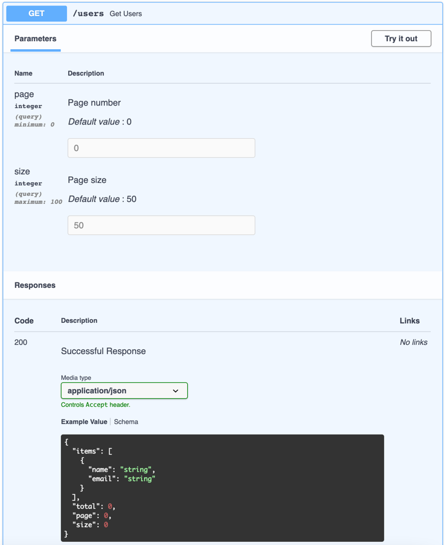

# FastAPI Pagination

FastAPI Pagination is an easy to use pagination addon for FastAPI.

## Features

* Multiple Page Types
* Extensible base page
* Full OpenAPI schema support
* Integrations to support multiple ORMs

## Installation

```bash
pip install fastapi-pagination
```

### Extras

To install fastapi-pagination with all available integrations:

```bash
pip install fastapi-pagination[all]
```

## Minimal Example

Example of code and generated OpenAPI specification.

```python
from fastapi import FastAPI
from pydantic import BaseModel

from fastapi_pagination import Page, add_pagination, paginate

app = FastAPI()


class User(BaseModel):
    name: str
    surname: str


users = [
    User(name='Yurii', surname='Karabas'),
    # ...
]


@app.get('/users', response_model=Page[User])
async def get_users():
    return paginate(users)


add_pagination(app)
```


