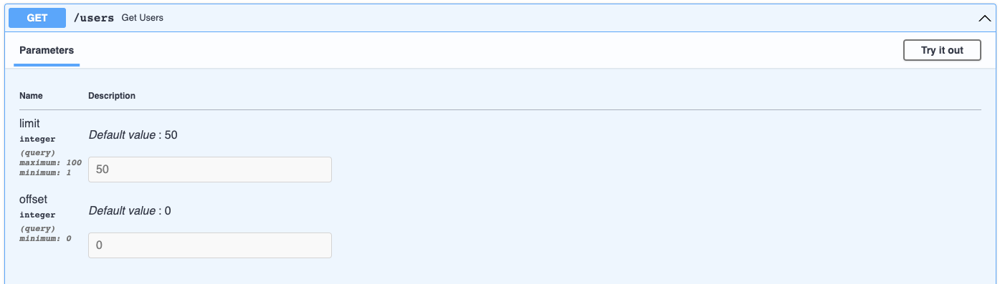

# Limit/ Offset

In some cases, you may need to use limit/ offset pagination. For these cases, you can use `fastapi_pagination.LimitOffsetPage` instead of the default `fastapi_pagination.Page`.

```python
from fastapi import FastAPI
from pydantic import BaseModel

from fastapi_pagination import LimitOffsetPage, add_pagination, paginate

app = FastAPI()


class User(BaseModel):
    name: str
    surname: str


users = [
    User(name='Yurii', surname='Karabas'),
    # ...
]


@app.get(
    '/users',
    response_model=LimitOffsetPage[User],
)
async def get_users():
    return paginate(users)


add_pagination(app)
```

This will be reflected in the OpenAPI schema.


