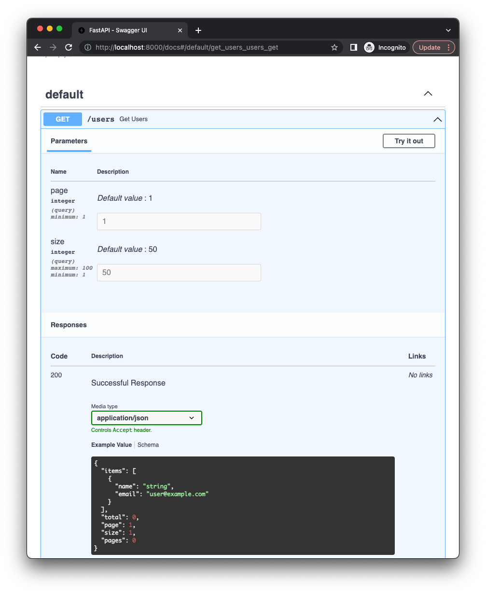

The simplest FastAPI pagination looks like this:

```py
{! ../docs_src/tutorial/first_steps.py !}
```

!!! warning "Be careful"
    
    If you use an ORM/DB framework you need to use the `paginate` function that is specific to your framework.
    Otherwise, you will need to load all data into memory and then paginate it which is not good for performance.

    You can find more information about integrations in
    [Available Integrations](../integrations/available-integrations.md) section.   

## Step 1: import pagination components

```py hl_lines="6"
{! ../docs_src/tutorial/first_steps.py !}
```

* `Page` - a class that represents a paginated data.
* `paginate` - a function that paginates data and returns a `Page` instance.
* `add_pagination` - a function that adds a pagination feature to the app.

## Step 2: add pagination to app

```py hl_lines="8-9"
{! ../docs_src/tutorial/first_steps.py !}
```

If you forget to add `add_pagination` to your app, pagination will not work.

!!! note "add_pagination"
    `add_pagination` will affect only endpoints that have `Page` as a return type/response model.

## Step 3: create a route

```py hl_lines="22"
{! ../docs_src/tutorial/first_steps.py !}
```

The return type/response model is `Page`. It means that this endpoint can use the `paginate` function inside it.

## Step 4: paginate the data

```py hl_lines="24"
{! ../docs_src/tutorial/first_steps.py !}
```

`paginate` function will return `Page` instance with paginated data.

## Step 5: Start the application and check OpenAPI docs

You will see that pagination parameters were added to the endpoint.


