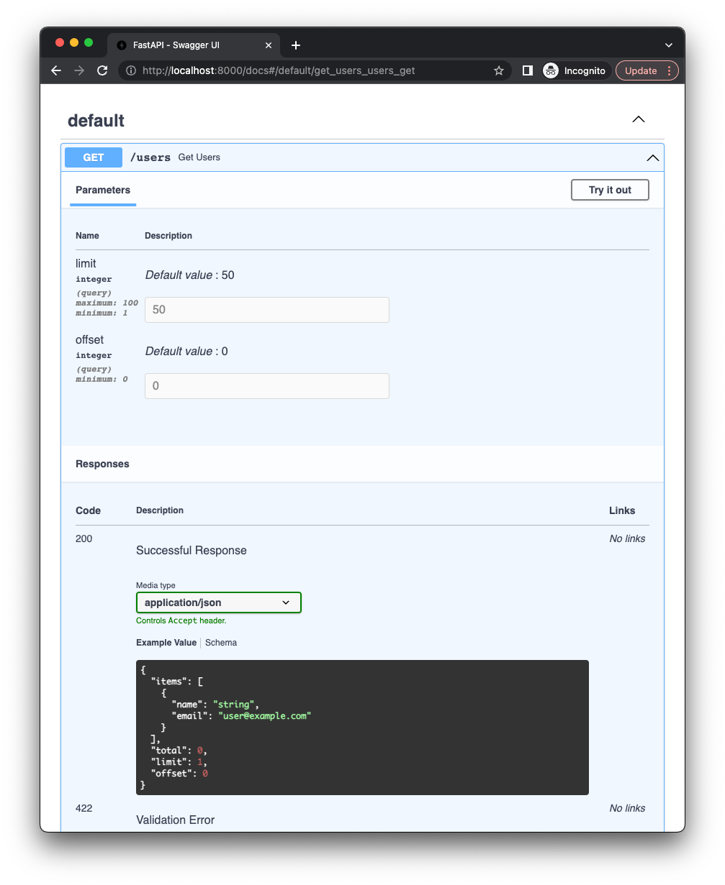

You can use `limit-offset` pagination type to paginate data by limit and offset.
In this tutorial, you will learn how to use `limit-offset` pagination type.


## General information

`limit` parameter is used to specify the number of items to fetch, and `offset` parameter is used to specify the
 number of items that we need to skip.

By default `limit` is `50` and `offset` is `0`, but you can change them.

Response schema will contain:

* `items` - list of items paginated items.
* `limit` - number of items per page.
* `offset` - number of skipped items.
* `total` - total number of items.


## Example

To use `limit-offset` you need to import `LimitOffsetPage` from `fastapi_pagination` and use it as a response model.

```py hl_lines="6"
{! ../docs_src/tutorial/limit_offset_pagination.py !}
```

Now when we will call `/users` endpoint we will get paginated data like this:

```3
GET /users?limit=3&offset=2
```

```json
{
  "items": [
    {
      "name": "John",
      "email": "john@example.com"
    },
    {
      "name": "Jane",
      "email": "jane@example.com"
    },
    {
      "name": "Bob",
      "email": "bob@example.com"
    }
  ],
  "limit": 3,
  "offset": 2,
  "total": 100
}
```

## OpenAPI

Code above will add pagination parameters to the endpoint and you will see them in the OpenAPI docs.


