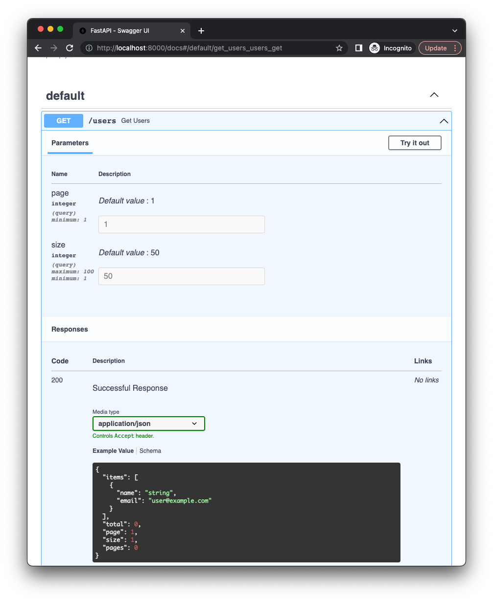

If you want to add pagination links to your response, you can use pages from `fastapi_pagination.links` module.
It contains `Page` class for `page-number` pagination, `LimitOffsetPage` for `limit-offset` pagination.

Response schema will contain additional `links` field with pagination links:

* `first` - link to the first page.
* `last` - link to the last page.
* `self` - link to the current page.
* `next` - link to the next page.
* `prev` - link to the previous page.

## Example

For instance, let user `page-number` pagination from `links` module:

```py hl_lines="7"
{! ../docs_src/tutorial/links_pagination.py !}
```

Now when we will call `/users` endpoint we will get paginated data like this:

```py
GET /users?page=2&size=3
```

```json
{
  "items": [
    {
      "name": "John",
      "email": "john@example.com"
    },
    {
      "name": "Jane",
      "email": "jane@example.com"
    },
    {
      "name": "Bob",
      "email": "bob@example.com"
    }
  ],
  "page": 2,
  "size": 3,
  "pages": 34,
  "total": 100,
  "links": {
    "first": "http://localhost:8000/users?page=1&size=3",
    "last": "http://localhost:8000/users?page=34&size=3",
    "self": "http://localhost:8000/users?page=2&size=3",
    "next": "http://localhost:8000/users?page=3&size=3",
    "prev": "http://localhost:8000/users?page=1&size=3"
  }
}
```

## OpenAPI

Code above will add pagination parameters to the endpoint and you will see them in the OpenAPI docs.


